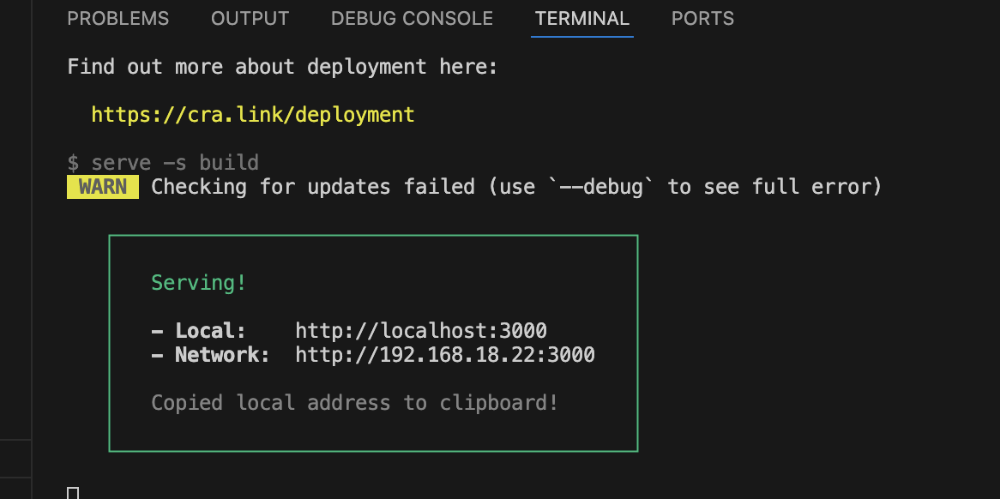

# appRimac

# Mi Proyecto React

Este proyecto fue creado con create-react-app y contiene una aplicación mobile first por ende abre la consola de desarrollador de tu navegador (por ejemplo, Chrome DevTools).

## Desarrollo y Despliegue

### Requisitos Previos

Asegúrate de tener Node.js y npm (o yarn) instalados en tu máquina.

### Pasos para Desarrollo y Despliegue

1. **Inspeccionar el Sitio en Dispositivos Móviles:**

   - Abre la consola de desarrollador de tu navegador (por ejemplo, Chrome DevTools).
   - Selecciona el modo de dispositivo móvil para asegurarte de que la aplicación se vea correctamente en dispositivos pequeños.

2. **Construir el Proyecto:**

```bash
   yarn build

   Este proyecto corre con yarn deploy

   